# 🧱 Technical Architecture & Vision

---

## 🧩 Universal CTO Stack
A foundational, opinionated stack for any startup or scale-up — designed for speed, resilience, and observability.

**Summary:**  
This stack defines the baseline architecture to deploy in any new project — covering frontend, backend, infra, monitoring, and security with CI/CD built-in.

📄 Full document → [Choose Your Ideal Technology Foundation (Google Doc)](https://docs.google.com/document/d/1llF80r-saFA7Le0GqJxjPjGU6LN6w6-omrT9sE-SyQM/edit?usp=sharing)  

---

### Security Baseline (Guaranteed)
- Secrets externalized (Vault/Doppler)
- SAST/Dependency scanning in CI
- RBAC enforced on Git & cloud
- Incident response **playbooks** (on-call, escalation, postmortems)

### Security Extensions (Context-driven)
- WAF / DDoS protection
- Encryption at rest
- MFA everywhere
- Compliance mapping (SOC2, ISO)

These are enabled based on regulatory, business, or customer requirements.

Security extensions are explicitly scoped, costed, and activated only when risk or regulation justifies them.

---

## ⚖️ CTO Decision Matrix
A practical decision framework for every architecture choice:  
When to use **Monolith vs Microservices**, **Node.js vs Go**, or **Compose vs Kubernetes**.

📄 Full matrix → [CTO Decision Guide – How to Choose Wisely (Google Doc)](https://docs.google.com/document/d/1llF80r-saFA7Le0GqJxjPjGU6LN6w6-omrT9sE-SyQM/edit?usp=sharing)  

---

## 🧭 Product ↔ Tech Vision Map 
Defines how product strategy translates into concrete technical architecture.  
Includes:
- The core technical bet  
- 3 architecture decisions that matter  
- MVP scope and out-of-scope cuts  
- Service ownership and key metrics  

📄 Full document → [Product–Tech Vision Map (Google Doc)](https://docs.google.com/document/d/18oHu0SalOD7IDXtZ2CMXdHP8R1cU20f6F6gB-q1hrrY/edit?usp=sharing)  

---

## 🗺️ Reference System Architecture (Mermaid Diagram)
Below is the high-level system view that underpins all templates.  

```mermaid
flowchart TD
    %% =========================
    %% USER & EXTERNAL FLOW
    %% =========================
    User["👤 User Request"] --> CDN["🌐 CDN / Edge Network"]
    
    %% =========================
    %% MULTI-CLOUD CONTEXT - 
    %% =========================
    CDN --> Cloud_Proxy["🌍 Cloud Proxy<br/>AWS/Azure/OVH"]
    
    %% =========================
    %% FRONTEND LAYER
    %% =========================
    Cloud_Proxy --> Frontend["Frontend<br/>Next.js App"]
    
    subgraph FrontendDeployment["Frontend Deployment"]
        Frontend
    end
    
    %% =========================
    %% BACKEND & API LAYER
    %% =========================
    Frontend --> API_Gateway["🌐 Cloud LB + Ingress<br/>(Nginx / Traefik)"]
    
    subgraph BackendServices["Backend Services"]
        B1["Service 1<br/>Node.js + TypeScript"]
        B2["Service 2<br/>Go (High Performance)"]
        B3["Service 3<br/>Rust (Critical Path)"]
    end
    
    API_Gateway --> BackendServices
    
    %% =========================
    %% DATA LAYER - MULTI-CLOUD MENTION
    %% =========================
    subgraph DataLayer["Data Layer<br/>Multi-Cloud Ready"]
        PostgreSQL["🛢️ PostgreSQL<br/>Primary Database"]
        Redis["📊 Redis<br/>Cache & Sessions"]
    end
    
    BackendServices --> PostgreSQL
    BackendServices --> Redis
    
    %% =========================
    %% INFRASTRUCTURE & SECURITY - MULTI-CLOUD
    %% =========================
    subgraph Infrastructure["Infrastructure as Code<br/>Multi-Cloud Terraform"]
        Terraform["Terraform<br/>AWS/Azure/OVH"]
        Docker["Docker<br/>Container Runtime"]
        Compose["Docker Compose<br/>(Default runtime)"]
        K8s["Kubernetes<br/>(Optional/Scale profile)"]
    end
    
    subgraph Security["Security & Auth"]
        Auth["🔐 Auth Service<br/>Clerk / Keycloak"]
        Vault["🗝️ Vault / Doppler<br/>Secrets Management"]
    end
    
    %% =========================
    %% OBSERVABILITY
    %% =========================
    subgraph Observability["Observability Stack"]
        Prometheus["📈 Prometheus<br/>Metrics"]
        Loki["📝 Loki<br/>Logs"]
        Grafana["📊 Grafana<br/>Dashboards"]
    end
    
    %% =========================
    %% DEVELOPMENT WORKFLOW - MULTI-CLOUD DEPLOY
    %% =========================
    subgraph CICD["CI/CD Pipeline<br/>Multi-Cloud Deploy"]
        Developer["👨‍💻 Developer"] --> Git["Git Push"]
        Git --> GH_Actions["GitHub Actions<br/>Build → Test → Scan"]
        GH_Actions --> Deploy["🚀 Auto Deploy<br/>AWS/Azure/OVH"]
    end
    
    %% =========================
    %% CRITICAL CONNECTIONS - CORRIGÉES
    %% =========================
    %% Infrastructure manages everything (solid arrows)
    Terraform -->|provisions| FrontendDeployment
    Terraform -->|provisions| BackendServices
    Terraform -->|provisions| DataLayer
    Terraform -->|provisions| Security
    Terraform -->|provisions| Observability
    
    %% All components report to observability
    BackendServices -->|metrics| Observability
    Frontend -->|logs| Observability
    DataLayer -->|metrics| Observability
    
    %% Authentication flows
    Frontend -->|auth| Auth
    BackendServices -->|validate| Auth
    BackendServices -->|secrets| Vault
    
    %% CI/CD deploys to infrastructure
    Deploy -->|updates| BackendServices
    Deploy -->|updates| FrontendDeployment
    
    %% =========================
    %% STYLING - AMÉLIORÉ
    %% =========================
    classDef frontend fill:#e1f5fe,stroke:#01579b,stroke-width:2px
    classDef backend fill:#f3e5f5,stroke:#4a148c,stroke-width:2px
    classDef data fill:#e8f5e8,stroke:#1b5e20,stroke-width:2px
    classDef infra fill:#fff3e0,stroke:#e65100,stroke-width:2px
    classDef security fill:#ffebee,stroke:#b71c1c,stroke-width:2px
    classDef monitoring fill:#fce4ec,stroke:#880e4f,stroke-width:2px
    classDef cicd fill:#e0f2f1,stroke:#004d40,stroke-width:2px
    classDef external fill:#f5f5f5,stroke:#666,stroke-width:1px
    classDef multicloud fill:#e8eaf6,stroke:#303f9f,stroke-width:2px
    
    class FrontendDeployment,Frontend frontend
    class BackendServices,API_Gateway backend
    class DataLayer data
    class Infrastructure infra
    class Security security
    class Observability monitoring
    class CICD cicd
    class User,CDN,Cloud_Proxy external
    class Cloud_Proxy multicloud
```

For detailed architectural doctrines or production-grade operational depth (DDD, distributed systems, runtime topologies, contracts, and evolutionary architecture), refer to the **CTO Operating System** architecture documentation (docs/architecture/*).

This portfolio focuses on strategic architecture vision and proof artifacts, while the Operating System provides production-grade operational depth and codifies day-to-day standards and enforcement in real environments.

---

## 🏗️ Infrastructure & Automation Overview

Synthesis of my five deployment templates — proving Infrastructure-as-Code and automation maturity.

### Tech Factory
Full repo → [TechFactory repository](https://github.com/matdup/TechFactory)

**Repositories:**
- **Infrastructure Template** (Multi-cloud Terraform + Docker + CI/CD)
- **Backend Template** (Go/Node + CI/CD + Security) 
- **Frontend Template** (Next.js + TypeScript + Storybook + CI/CD)
- **Monitoring Template** (Grafana + Loki + Prometheus + CI/CD)
- **Docs Template** (MkDocs + CI/CD + Auto-deploy)

Each repository contains a complete, reusable boilerplate with **production-ready CI/CD pipelines, security scanning, and multi-cloud support**.

---

💡 **CTO Takeaway:**  
Architecture is leadership in disguise — this stack makes execution predictable and scalable from day 1, with zero vendor lock-in and enterprise-grade security.