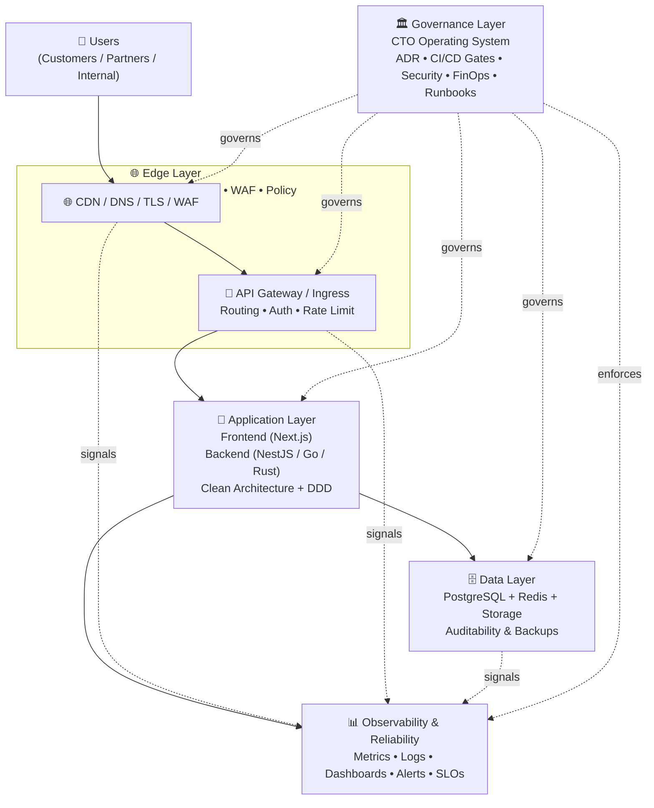
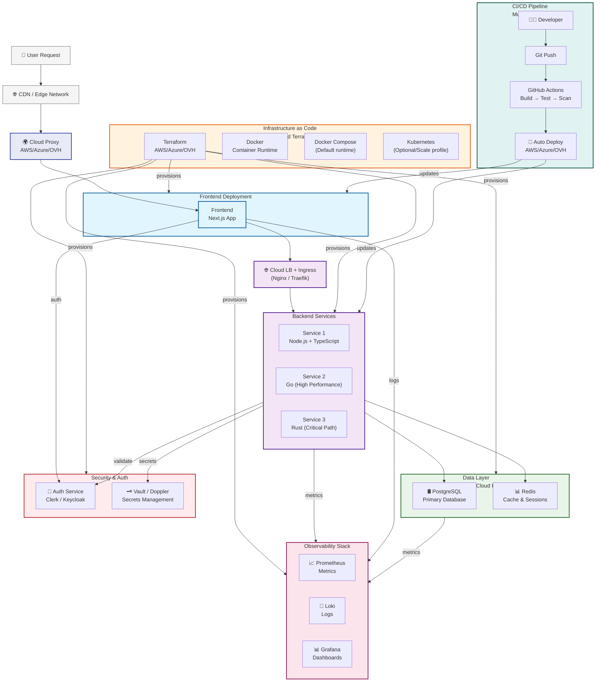

# 🚀 Mat Dupré — CTO Portfolio — 
**Speed with Safety — From Vision to production** Building scalable systems, empowering teams, and turning technology into strategy into measurable business value.  
**Hands-on CTO (0→1 builder + complex legacy environments)** specializing in fintech, infrastructure, and cost-aware scalable systems.
📍 Remote (Europe) — Based in France  
🌍 Open to relocation: USA, Switzerland (long-term CTO / Founding roles) | 💬 [LinkedIn](https://www.linkedin.com/in/mathdupre)

---

## 🎯 Executive Summary

**I architect and deliver complete technology platforms that transform business vision into production-ready systems in days, not months.** This portfolio demonstrates a proven **CTO Execution System**: a complete operating model combining strategy, governance, and execution to build scalable, secure, and cost-effective technology organizations from idea to production-ready systems.

It integrates architecture, automation, and leadership frameworks into a unified, deployable system.
This system is concretely implemented through a governance Operating System and a production-grade CTO Golden Repo (industrial execution layer).

I operate as a hands-on CTO, capable of designing, building, and deploying full production-grade systems (architecture, CI/CD, observability, security, and infrastructure) from 0 to MVP, production, and scaling phases. Including AI-ready by default (governed, cost-capped, auditable) — same standards as any production service.

My approach prioritizes pragmatic execution: ship fast, secure early, and scale only when real usage justifies architectural complexity.

I have operated both as a CTO in 0 to 1 product environments and as a CTO in complex legacy environments requiring architectural reconstruction and governance setup.

🔎 This portfolio complements my CV by providing concrete execution evidence, architecture artifacts, and real-world CTO case studies (0→1 build and legacy system reconstruction).

---

⏱️ 90-second read:
- CTO Execution Snapshot (real-world proof)
- Executive System Overview (diagram)
- Reference Architecture (production system)

This README is the executive entrypoint of the CTO Execution System.
It explains how strategy, governance, and execution fit together across company stages.

---

## 🧠 Maturity-Aware CTO Execution System

The system presented in this portfolio is **modular, platform-oriented, and maturity-aware**.

It is not designed as a fixed architecture or a one-size-fits-all stack.

Instead, it provides a **reproducible engineering platform blueprint** that evolves with the maturity of the company.

Capabilities are progressively activated only when justified by real constraints:
product traction, team growth, reliability requirements, or regulatory pressure.

| Company Stage | Focus | System Activation |
|---|---|---|
| **0 → 1 (Validation)** | Ship fast and validate the product | Modular monolith, Docker Compose runtime, minimal infrastructure |
| **1 → 10 (Growth)** | Reliability and operational discipline | Observability stack, CI/CD automation, infrastructure as code |
| **10 → 100 (Scale)** | Distributed architecture and platform engineering | Service isolation, SLO-driven reliability, Kubernetes and platform tooling |

The objective is simple:

> **Start simple. Stay secure and observable. Scale and evolve architecture when reality demands it.**

This approach avoids premature complexity while ensuring the system can scale without architectural rewrites.

---

## 📌 Table of Contents
- [Executive Summary](#-executive-summary)
- [Maturity-Aware CTO Execution System](#-maturity-aware-cto-execution-system)
- [CTO Execution Snapshot](#-cto-execution-snapshot-what-i-actually-deliver)
- [CTO System Overview (Executive View)](#-cto-system-overview-executive-view)
- [Technical Reference Architecture (Engineering View)](#-technical-reference-architecture-engineering-view)
- [Cost & FinOps](#-cost--finops--budget-aware-cto-strategy)
- [Key Achievements](#-key-achievements)
- [Core Artifacts](#-core-artifacts)
- [Stack Coverage](#stack-coverage--canonical-foundation-baseline-fully-aligned-with-stack-foundation-kit)
- [AI by Default](#-ai-by-default--governed-ai-enablement-optional-but-ready)
- [i18n / l10n](#product-data--business--frontend-multi-language-i18n--l10n)
- [Strategic Differentiation](#-strategic-differentiation)
- [Business Impact](#-business-impact-delivered)
- [About](#-about-this-portfolio)

---

## ⚡ CTO Execution Snapshot (What I Actually Deliver)

Hands-on CTO with end-to-end ownership from architecture to production in regulated, high-complexity, and resource-constrained environments.

### 🚀 CTO Execution — TokAssets (Fintech & Tokenization Infrastructure)
- Designed and led the architecture of a compliance-first tokenization platform (fintech UX, blockchain-secure core) from 0 to production
- Built a modular backend (Rust + Clean Architecture + DDD) for scalability, auditability, and regulatory adaptability
- Implemented compliance-by-design workflows and auditability patterns (KYC/AML, custody, ...) aligned with MiCA, SEC Reg A+, FINMA, VARA (jurisdiction-dependent)
- Structured white-label infrastructure for banks, wealth managers, and institutional distribution
- Led CI/CD, infrastructure automation (Docker, Terraform), monitoring, and incident-ready observability
- Established governance foundations: documentation standards, audit readiness, ownership model, and technical operating framework
- Improved system performance and on-chain/off-chain synchronization (~30% latency reduction)


### 🧩 CTO Execution in Complex Legacy Environment — Swisstronik
- Took over a large multi-repository environment (~90+ repositories) without prior handover
- Audited distributed infrastructure (OVH servers, validators, RPC, backend services)
- Reconstructed technical architecture, infrastructure mapping, and repository classification to restore full infrastructure and system visibility
- Mapped Server ↔ Repository ↔ Services relationships to support HLD documentation and governance
- Established technical governance foundations (documentation standards, auditability, ownership model)
- Made strategic technical decisions under an absence of documentation, legacy complexity, and organizational constraints

### 🧱 Real-World Platform Engineering
- Designed full technology foundations (architecture, CI/CD, observability, security) from 0 to production-ready systems
- Built deployable multi-cloud infrastructure templates (OVH / AWS / Azure) using Terraform + Docker
- Designed and built a CTO Golden Repo: an industrial, governance-aligned execution repository enabling <10 min environment bootstrap (apps + infra + platform + observability)
- Implemented cost-aware architecture strategies (Compose-first, scale-by-evidence, FinOps guardrails)
- Established governance systems (ADR, runbooks, SLOs, CI/CD enforcement) for audit-ready operations


### Delivery Philosophy
Ship fast. Secure early.  
Document decisions.  
Scale only when evidence justifies complexity.

---

## 🧭 CTO System Overview (Executive View)

This diagram presents the high-level architecture of the CTO Execution System:
- Edge layer ensures secure and scalable entry (CDN, Gateway)
- Application layer follows modular monolith → microservices evolution with Clean Architecture & DDD
- Data layer prioritizes reliability, auditability, and cost-aware scaling
- Observability is built-in from day one (metrics, logs, alerts, SLOs)
- Governance layer (CTO Operating System) enforces security, CI/CD discipline, incident readiness, and cost control across the entire system

Goal: ship fast, stay secure, and scale without architectural rewrites.

Purpose: show layers + governance overlay.


```mermaid
flowchart TB
    %% =========================
    %% EXECUTIVE CTO VIEW (VERTICAL - README FRIENDLY)
    %% =========================

    %% USER
    User["👤 Users<br/>(Customers / Partners / Internal)"]

    %% EDGE LAYER
    subgraph EdgeLayer["🌐 Edge Layer<br/>CDN • DNS • TLS • WAF • Policy"]
        Edge["🌐 CDN / DNS / TLS / WAF"]
        Gateway["🚪 API Gateway / Ingress<br/>Routing • Auth • Rate Limit"]
        Edge --> Gateway
    end

    %% APPLICATION LAYER
    App["🧩 Application Layer<br/>Frontend (Next.js)<br/>Backend (NestJS / Go / Rust)<br/>Clean Architecture + DDD"]

    %% DATA LAYER
    Data["🗄️ Data Layer<br/>PostgreSQL + Redis + Storage<br/>Auditability & Backups"]

    %% OBSERVABILITY
    Observability["📊 Observability & Reliability<br/>Metrics • Logs • Dashboards • Alerts • SLOs"]

    %% GOVERNANCE
    Governance["🏛️ Governance Layer<br/>CTO Operating System<br/>ADR • CI/CD Gates • Security • FinOps • Runbooks"]

    %% MAIN FLOW (TOP → BOTTOM)
    User --> Edge
    Gateway --> App
    App --> Data
    App --> Observability
    Edge -. signals .-> Observability
    Gateway -. signals .-> Observability
    Data -. signals .-> Observability

    %% GOVERNANCE OVERLAY (EXECUTIVE CONCEPT)
    Governance -. governs .-> Edge
    Governance -. governs .-> Gateway
    Governance -. governs .-> App
    Governance -. governs .-> Data
    Governance -. enforces .-> Observability
```

---

## 🧱 Technical Reference Architecture (Engineering View)

This diagram shows the production-grade technical architecture 
behind the CTO Execution System (multi-cloud, CI/CD, observability, security, IaC).

Purpose: show deployable production system + multi-cloud + CI/CD...


```mermaid
flowchart TD
    %% =========================
    %% USER & EXTERNAL FLOW
    %% =========================
    User["👤 User Request"] --> CDN["🌐 CDN / Edge Network"]
    
    %% =========================
    %% MULTI-CLOUD CONTEXT - 
    %% =========================
    CDN --> Cloud_Proxy["🌍 Cloud Proxy<br/>AWS/Azure/OVH"]
    
    %% =========================
    %% FRONTEND LAYER
    %% =========================
    Cloud_Proxy --> Frontend["Frontend<br/>Next.js App"]
    
    subgraph FrontendDeployment["Frontend Deployment"]
        Frontend
    end
    
    %% =========================
    %% BACKEND & API LAYER
    %% =========================
    Frontend --> API_Gateway["🌐 Cloud LB + Ingress<br/>(Nginx / Traefik)"]
    
    subgraph BackendServices["Backend Services"]
        B1["Service 1<br/>Node.js + TypeScript"]
        B2["Service 2<br/>Go (High Performance)"]
        B3["Service 3<br/>Rust (Critical Path)"]
    end
    
    API_Gateway --> BackendServices
    
    %% =========================
    %% DATA LAYER - MULTI-CLOUD MENTION
    %% =========================
    subgraph DataLayer["Data Layer<br/>Multi-Cloud Ready"]
        PostgreSQL["🛢️ PostgreSQL<br/>Primary Database"]
        Redis["📊 Redis<br/>Cache & Sessions"]
    end
    
    BackendServices --> PostgreSQL
    BackendServices --> Redis
    
    %% =========================
    %% INFRASTRUCTURE & SECURITY - MULTI-CLOUD
    %% =========================
    subgraph Infrastructure["Infrastructure as Code<br/>Multi-Cloud Terraform"]
        Terraform["Terraform<br/>AWS/Azure/OVH"]
        Docker["Docker<br/>Container Runtime"]
        Compose["Docker Compose<br/>(Default runtime)"]
        K8s["Kubernetes<br/>(Optional/Scale profile)"]
    end
    
    subgraph Security["Security & Auth"]
        Auth["🔐 Auth Service<br/>Clerk / Keycloak"]
        Vault["🗝️ Vault / Doppler<br/>Secrets Management"]
    end
    
    %% =========================
    %% OBSERVABILITY
    %% =========================
    subgraph Observability["Observability Stack"]
        Prometheus["📈 Prometheus<br/>Metrics"]
        Loki["📝 Loki<br/>Logs"]
        Grafana["📊 Grafana<br/>Dashboards"]
    end
    
    %% =========================
    %% DEVELOPMENT WORKFLOW - MULTI-CLOUD DEPLOY
    %% =========================
    subgraph CICD["CI/CD Pipeline<br/>Multi-Cloud Deploy"]
        Developer["👨‍💻 Developer"] --> Git["Git Push"]
        Git --> GH_Actions["GitHub Actions<br/>Build → Test → Scan"]
        GH_Actions --> Deploy["🚀 Auto Deploy<br/>AWS/Azure/OVH"]
    end
    
    %% =========================
    %% CRITICAL CONNECTIONS - CORRIGÉES
    %% =========================
    %% Infrastructure manages everything (solid arrows)
    Terraform -->|provisions| FrontendDeployment
    Terraform -->|provisions| BackendServices
    Terraform -->|provisions| DataLayer
    Terraform -->|provisions| Security
    Terraform -->|provisions| Observability
    
    %% All components report to observability
    BackendServices -->|metrics| Observability
    Frontend -->|logs| Observability
    DataLayer -->|metrics| Observability
    
    %% Authentication flows
    Frontend -->|auth| Auth
    BackendServices -->|validate| Auth
    BackendServices -->|secrets| Vault
    
    %% CI/CD deploys to infrastructure
    Deploy -->|updates| BackendServices
    Deploy -->|updates| FrontendDeployment
    
    %% =========================
    %% STYLING - AMÉLIORÉ
    %% =========================
    classDef frontend fill:#e1f5fe,stroke:#01579b,stroke-width:2px
    classDef backend fill:#f3e5f5,stroke:#4a148c,stroke-width:2px
    classDef data fill:#e8f5e8,stroke:#1b5e20,stroke-width:2px
    classDef infra fill:#fff3e0,stroke:#e65100,stroke-width:2px
    classDef security fill:#ffebee,stroke:#b71c1c,stroke-width:2px
    classDef monitoring fill:#fce4ec,stroke:#880e4f,stroke-width:2px
    classDef cicd fill:#e0f2f1,stroke:#004d40,stroke-width:2px
    classDef external fill:#f5f5f5,stroke:#666,stroke-width:1px
    classDef multicloud fill:#e8eaf6,stroke:#303f9f,stroke-width:2px
    
    class FrontendDeployment,Frontend frontend
    class BackendServices,API_Gateway backend
    class DataLayer data
    class Infrastructure infra
    class Security security
    class Observability monitoring
    class CICD cicd
    class User,CDN,Cloud_Proxy external
    class Cloud_Proxy multicloud
```

---

## 💸 Cost & FinOps — Budget-Aware CTO Strategy

This portfolio is designed with **cost as a first-class architectural constraint**.

### Core Principles
- Start with **cost-efficient defaults**, not hyperscaler dogma
- Prefer **simple infrastructure** over premature scalability
- Scale **only when usage, revenue, or risk justify it**
- Treat cloud providers as **replaceable vendors**, not strategic dependencies

### Default Cost-Conscious Choices
- Docker Compose before Kubernetes
- Single region before multi-region
- Managed services only when operational savings outweigh cost
- Observability scoped to actionable signals (no vanity metrics)
- Infrastructure sized for **real traffic, not projected fantasies**

### FinOps Guardrails
- Monthly budget and alert thresholds per environment
- Cost ownership assigned per service or team
- Regular cost reviews (monthly MVP / quarterly scale)
- Architecture decisions documented with **cost impact** in ADRs

### CTO Position
> “Scalability is not a goal.  
> **Sustainable growth at controlled cost is.**”

This framework prevents over-engineering, vendor lock-in, and runaway cloud spend — while keeping the system **ready to scale when it actually matters**.

---

## 🌟 Key Achievements

### 🏆 **Multi-Cloud Platform Engineering**
**Built a universal cloud abstraction layer** that deploys identical infrastructure across OVH, AWS, and Azure with a single command:
```bash
terraform apply -var="cloud_provider=aws|azure|ovh"
```
- **80% faster** deployment time vs traditional approaches
- **Zero vendor lock-in** with cloud-agnostic architecture
- **Enterprise security** with Vault integration and automated scanning
- **Production-ready** monitoring and observability stack

---

## 🎯 Core Artifacts

**CTO Execution System (3 layers):**
- **Strategic Layer (Docs):** Portfolio & architecture vision (Stack Foundation Kit + Decision Matrix + Product–Tech Vision Map...)
- **Operating System (Governance):** CTO Operating System repo (organizational discipline) 
- **Execution Layer (Code):** CTO Golden Repo — deployable engineering platform blueprint (apps, infra, platform services, governance-aligned structure) 

Each layer is **modular and maturity-aware**, activating progressively depending on the company stage (MVP → Growth → Scale).

The Operating System defines how teams work.
The Golden Repo defines how systems are built.

This system is designed to be reusable across companies and product contexts. It allows companies to move from idea to production-ready platforms in weeks instead of months while maintaining enterprise-grade security, observability, and governance from day one.

### 🧭 Full Repo → [CTO Portfolio (Strategic Layer)](https://github.com/matdup/cto-portfolio)

#### 🧱 Full document → [Technical Architecture & Vision](ARCHITECTURE.md)
- **Universal CTO Stack** - (frontend, backend, infra, monitoring, security)
- **Decision Matrix** - Architecture trade-offs (Monolith vs Microservices, Node vs Go, etc.)
- **Product ↔ Tech Vision Map** - linking business strategy to system design
- **Reference System Diagram** + Infrastructure as a Code (IaC) overview

💡 *Goal: a reproducible, audit-ready architecture deployable in minutes.*

#### 🧭 Full document → [Leadership Frameworks](LEADERSHIP.md)
- **CTO Manifesto** – leadership operating system
- **Tech Radar & Roadmap Framework** – Technology adoption & strategic focus
- **FinOps & Risk Matrix** – Cost control & risk visibility
- **CTO Operating System** – Operational Governance System
(Architecture, Security, SLOs, Incident Response, Compliance, and Engineering Operating Model)
- **Strategic Storytelling** – 3 CTO pitches (CEO / Team / Investors)

💡 *Goal: transform technical execution into organizational trust and business clarity.*

#### 🧭 Full document → [Scalability, Security & Reliability](SCALABILITY_SECURITY_RELIABILITY.md)
- **Production KPIs & SLO Targets** – latency p95, availability 99.9%, MTTR/MTTD, DORA metrics  
- **Scale Model (1K → 100K → 1M users)** – progressive evolution & evidence-based triggers  
- **Performance Engineering** – rate limiting, connection pooling, query rules, load testing (k6)  
- **Distributed Systems Strategy** – CAP tradeoffs, outbox/saga, retries/DLQ, backpressure & load shedding  
- **Multi-Tenant Isolation** – tenant boundaries, progressive isolation levels, auditability  
- **Security Architecture** – STRIDE threat modeling, encryption strategy, key management, abuse protection  

💡 *Goal: a production-grade scaling + reliability doctrine, aligned with measurable SLOs and cost-aware growth.*  

---

### 🧭 Full Repo → [CTO Operating System (Governance Layer)](https://github.com/matdup/cto-operating-system)
This portfolio shows **vision + proof**. The CTO Operating System is the **governance operating system** behind it — the day-to-day standards that make delivery fast, safe, and auditable.

It contains:
- **Governance & decision-making:** ADR / RFC discipline, ownership model, compliance baseline
- **Engineering execution:** dev process, QA gates, CI/CD & release discipline
- **Production operations:** incident management, on-call & escalation, runbooks, DR (RPO/RTO)
- **Architecture doctrine:** DDD boundaries, contracts/versioning, distributed patterns, SLO engineering, security/threat modeling
- **Enforcement:** CODEOWNERS, repo compliance contract, quarterly audits & evidence records


📘 *Deep operational standards live in this* **[CTO Operating System](https://github.com/matdup/cto-operating-system)** *(docs/architecture/*).*

Key areas include:
- architecture principles & ADR discipline
- domain-driven design & service boundaries
- distributed systems patterns and runtime topology
- scalability engineering & SLO practices
- security architecture & threat modeling
- brownfield migration strategies
- ML systems architecture
- serverless & event-driven cloud patterns
- architecture documentation standards (C4 views)

---

### 🏗️ Full repo → [CTO Golden Repo (Execution Layer - Deployable Foundation)](https://github.com/matdup/cto-golden-repo)
**Objective:** build a bulletproof industrial foundation deployable in **< 10 minutes**.

This repository is a production-ready, governance-aligned foundation with CI/CD, IaC, security scanning, and observability built-in.
It can bootstrap a company in hours — not weeks.

| Capability | Location (cto-golden-repo) | Key Features |
|-----------|-----------------------------|--------------|
| Infrastructure | https://github.com/matdup/cto-golden-repo/tree/main/apps/infrastructure | Docker Compose runtime + Terraform multi-env (dev/staging/prod) + multi-cloud abstraction |
| Backend (Node / NestJS) | https://github.com/matdup/cto-golden-repo/tree/main/apps/backend/nestjs-app | Clean Architecture + DDD contexts + shared cross-cutting (security/tenancy/observability) |
| Backend (Go) | https://github.com/matdup/cto-golden-repo/tree/main/apps/backend/go-service | High-performance service skeleton + health endpoint + Docker |
| Frontend (Next.js) | https://github.com/matdup/cto-golden-repo/tree/main/apps/frontend | Next.js + TS + i18n-ready + E2E smoke (Playwright) + Docker |
| Contracts | https://github.com/matdup/cto-golden-repo/tree/main/contracts | OpenAPI v1 + schemas + compat rules + contract-tests |
| Observability / Monitoring | https://github.com/matdup/cto-golden-repo/tree/main/platform/monitoring | Grafana + Prometheus + Loki + Alertmanager + SLO rules + runbooks + compose |
| Security Tooling | https://github.com/matdup/cto-golden-repo/tree/main/platform/security | Gitleaks + SBOM (Syft) + Trivy config + security policies |
| Docs (MkDocs) | https://github.com/matdup/cto-golden-repo/tree/main/docs | MkDocs site + ADRs + architecture/guides/tech-runbooks |
| Governance Pack | https://github.com/matdup/cto-golden-repo/tree/main/governance | FinOps, risk matrix, retention, classification, repo constraints, ownership model |
| Ops Runbooks | https://github.com/matdup/cto-golden-repo/tree/main/ops-runbooks | Incident response + rollback + DR + security incident procedures |
| Automation Scripts | https://github.com/matdup/cto-golden-repo/tree/main/scripts | Deploy/healthcheck/backup/migrate/rollback helpers |

---

## Stack Coverage — Canonical Foundation Baseline (Fully Aligned with Stack Foundation Kit)

| Domain | 🟢 Baseline (Non-negotiable / Shipped) | 🟡 Growth (Enable when justified) | 🔴 Scale (Advanced / Context-driven) |
|---|---|---|---|
| CI/CD & Release Safety | GitHub Actions + tests + security scans + rollback + feature flags | Blue/Green deploy | Canary + progressive delivery |
| Observability | Logs + metrics + dashboards + alerts + runbooks | Tracing (OpenTelemetry) | Distributed tracing + SLO automation |
| Security & Secrets | Secrets manager + SAST + secret scanning + SBOM | WAF | HSM / advanced key custody |
| Supply Chain | SBOM (Syft) + dependency scanning + artifact traceability | Signing (cosign) | Full provenance & attestations |
| Data Lifecycle | Migrations + daily backups + restore procedures | Quarterly restore drills | Multi-region DR |
| Auditability | ADRs + audit logs + deploy evidence retention | Correlated audit events | Tamper-resistant audit storage |
| Data Governance | Data classification (PII/sensitive) + retention policies | DLP automation | Compliance-grade retention mapping |
| FinOps | Budget alerts + tagging + cost ownership | Monthly cost reviews | Chargeback + anomaly detection |
| Compute & Orchestration | Docker + Compose (default runtime) | Kubernetes profile available | Multi-cluster / service mesh |
| Contracts & APIs | OpenAPI + versioning + compatibility rules | Contract testing | Cross-team contract governance |
| Multi-tenancy | tenant_id enforcement + logical isolation | Schema-per-tenant | Dedicated infra per tenant (regulated) |
| Documentation | MkDocs + ADR + runbooks | Full internal doc portal | Compliance audit documentation |
| Product Foundation | i18n-ready architecture | Localization workflow | Multi-market SEO + legal localization |
| Environments | Dev/Staging/Prod parity + config isolation | Preview environments | Multi-region regulated isolation |
| Quality & Testing | Unit+integration + critical E2E (Playwright) in CI | Perf smoke (k6) | Perf gates / contract + load suites |

---

### 🧠 AI by Default — Governed AI Enablement (Optional but Ready)

AI is treated as **infrastructure**, not a feature.

| Capability | Baseline (🟢) | Growth (🟡) | Scale (🔴) |
|---|---|---|---|
| AI Gateway (single entry point) | Policy + routing + retries | Multi-model routing | Multi-region / HA |
| Tool access (MCP / internal tools) | Permissioned tools | Scoped per tenant/use case | Fine-grained tool RBAC + approvals |
| Audit logging | Redacted logs (prompt metadata + tool/action logs) | Correlation IDs + retention policy | Tamper-resistant storage / compliance retention |
| Cost control | Token budgets + alerts | Per-tenant caps | Anomaly detection + chargeback |
| Observability | Usage metrics + error rates | Latency/SLOs | Full tracing when distributed |
| Human override | Sensitive actions require approval | Workflow approvals | Partial autonomy only with safety gates |
| Data safety | PII redaction + prompt/context sanitization + no-secrets-to-LLM policy | RAG permission-aware retrieval | Full DLP + compliance logging |
| Guardrails | JSON schema output validation + tool allowlist + typed args | Expanded policy packs | Formal verification / high-assurance flows |

CTO Rule: **AI ships only if it is permissioned, observable, auditable, and cost-controlled.**

---

### Product, data & business — Frontend multi-language (i18n / l10n)

| Item | MVP | Scale | Regulated | 💸 |
|------|-----|-------|-----------|----|
| i18n strategy (target languages, ownership, workflow) | ⭕ | 🟡 | 🟢 | ↓ |
| UI internationalization (i18n framework) | ⭕ | 🟡 | 🟢 | ↓ |
| Localization (dates, currencies, timezones, pluralization) | ❌ | 🟡 | 🟢 | ↓ |
| Localized routing & URLs (/fr, /en) | ❌ | 🟡 | 🟢 | ↓ |
| Translation management (files, TMS, review process) | ❌ | 🟡 | 🟢 | ↓ |
| Fallback & coverage (missing keys, QA) | ❌ | 🟡 | 🟢 | ↓ |
| Multi-language SEO (hreflang, sitemaps) | ❌ | 🟡 | 🟢 | ↓ |
| Localized legal content (T&Cs, privacy, consent) | ❌ | ⭕ | 🟢 | ↓ |

**Quick interpretation**
- **MVP (⭕):** not necessarily translated, but i18n-ready architecture + clear strategy (otherwise massive future debt).
- **Scale (🟡):** actual i18n activation with a translation workflow.
- **Regulated (🟢):** localized legal content with traceability requirements.

---

💡 **CTO Insight:**
Your stack is your strategy. This execution system translates architecture into delivery discipline and market speed.

---

### 🧠 Strategic Differentiation

This framework represents a battle-tested methodology for building robust, observable, and scalable tech organizations.

---

### The **Speed With Safety** Advantage
- Multi-cloud agility without complexity overhead  
- Enterprise security without bureaucratic processes  
- Production monitoring without manual setup  
- Team scalability without tribal knowledge 

---

### Business Impact Delivered

| Challenge | Solution | Outcome |
|------------|-----------|----------|
| Slow time-to-market | CTO Golden repo + automation | Weeks → Hours |
| Cloud vendor risk | Cloud-agnostic architecture | Negotiation leverage |
| Security compliance | Built-in scanning + Vault | Audit readiness |
| Cost predictability | Multi-cloud + FinOps | 30–50% optimization |

---

### 🎖️ Leadership Signature

I build capabilities, not just systems:

- **Technical Excellence** that delivers measurable business outcomes  
- **Strategic Foresight** that anticipates market shifts  
- **Operational Discipline** that ensures reliability at scale  
- **Team Empowerment** that multiplies organizational capacity  

Let's discuss how we can apply these patterns to accelerate your technology strategy.

---

## 🧠 About this Portfolio
This portfolio presents a **CTO Execution System** — a reusable execution model for building robust, observable, and scalable tech organizations.

It combines:
- **Strategic Vision** → Product ↔ Tech alignment  
- **Technical Execution** → Industrial-grade CI/CD & IaC  
- **Operational Excellence** → FinOps, Observability, Governance  
- **Leadership** → Clear communication, playbooks, and systems thinking  

---

**I build teams and systems that scale without chaos.**

---

This portfolio defines a complete CTO Execution System, designed to be adapted to any company context.
It is not a fixed stack, but a decision framework that evolves with product maturity, regulatory constraints, and organizational scale.

---

📎 For contact or speaking inquiries: [LinkedIn](https://www.linkedin.com/in/mathdupre)